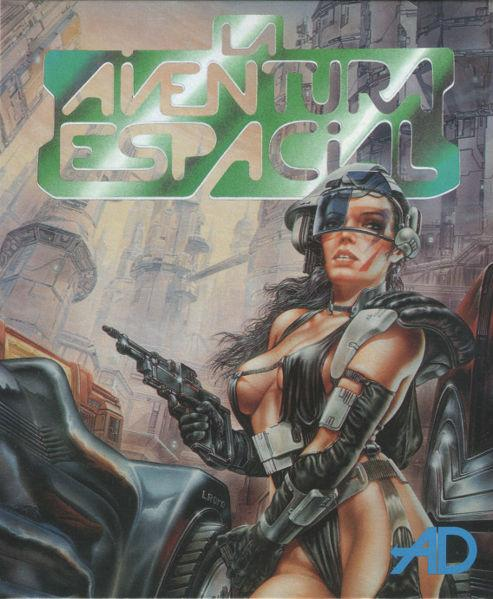

# La Aventura Espacial 1

_La Aventura Espacial es un relato interactivo escrito en Inform 6._

> Como nuevo y flamante comando espacial, debes prepararte para tu misión en el Anillo Dorado.

_La Aventura Espacial_ es un relato interactivo basado en una aventura conversacional, manejada por menús, de los años 80. La empresa que la creó fue **Aventuras AD**, dirigida por el icónico Andrés Samudio.

.

En esta primera parte, disponible en origen únicamente para PC, Atari y Amiga, acabas de terminar tu período de aprendizaje en el Anillo Dorado y eres ya todo un Cosme. Debes prepararte para la peligrosa misión que te encomendarán.

Localizaciones del Anillo Dorado:

- ZOED = Zona de Educación     
- ZOT  = Zona de Tránsito
- ZOES = Zona de Esparcimiento
- ZODO = Zona de Documentación
- ZOIN = Zona de Ingeniería
- ZODE = Zona de Cambio Atmosférico (descompresión)

## Concursos

Este es el remake de "La aventura espacial", escrita para la II Retrocomp por Baltasar.

## Construcción

Este relato fue escrito en [Inform 6](https://github.com/DavidKinder/Inform6). Para recompilarlo, será necesrio `bresc`, y las herramientas `blorb`. El proyecto [Scinf](http://github.com/baltasarq/Scinf) será de gran ayuda.

## Ejecución

El archivo `blb` o `gblorb` debe ser ejectuado mediante un intérprete, por ejemplo, [Gargoyle](https://ccxvii.net/gargoyle/).

Según el intérprete utilizado se soportarán algunas facilidades u otras. En general, en todos los intérpretes en los que se ejecutara la aventura deben estar disponibles gráficos y sonidos. Me he encontrado con que los hiperenlaces funcionan tan solo en algunos intérpretes.

## Legalidades

Los derechos sobre las aventuras de Aventuras AD fueron cedidos al público, por lo que esta versión es legal.

En cualquier caso, el autor no pretende hacerse con la autoría de la aventura original, sino rendir un tributo a la misma.

Por otra parte, esta aventura toma la ambientación e historia general de la Aventura Espacial, pero difiere de la original en numerosos aspectos.
